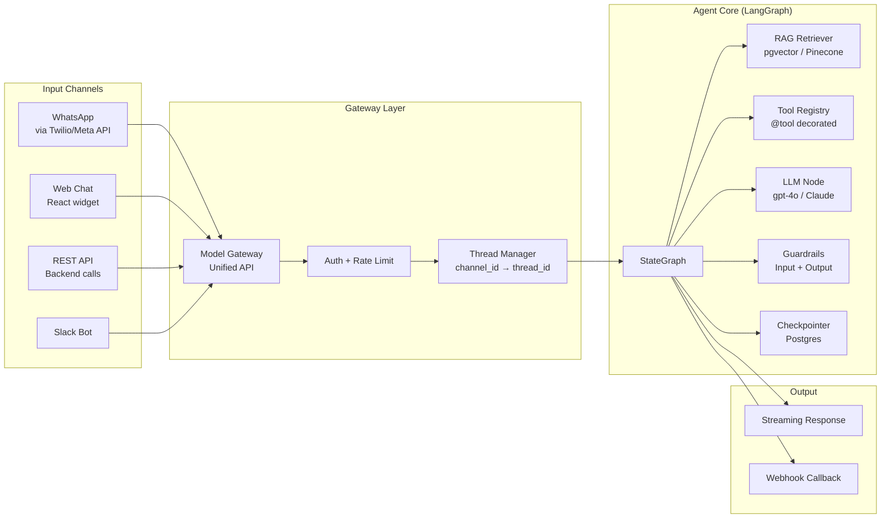

# ADW → Agent Production Framework
## From GitHub Automation to Conversational AI Agents

**Codebase:** `system-zero/adws/` only  
**NLM:** AI Books Library (`5f600ccc`) — 4 queries, 11 books cited  
**Date:** March 8, 2026

---

## Part 1: What We Have (System-Zero ADWs)

### The Engine

```mermaid
graph TB
    subgraph "Triggers"
        ISS[GitHub Issue<br/>/feature /bug /chore]
        CRON[trigger_cron.py<br/>20s polling]
        WH[trigger_webhook.py<br/>Real-time]
        TW[trigger_transcript_watch.py<br/>File watcher]
    end
    
    subgraph "Orchestrators"
        PB[plan_build_iso]
        PBT[plan_build_test_iso]
        PBTR[plan_build_test_review_iso]
        SDLC[sdlc_iso<br/>Full pipeline]
        ZTE[sdlc_zte_iso<br/>⚠️ Auto-ship]
    end
    
    subgraph "Phase Modules"
        PLAN[adw_plan_iso.py<br/>Worktree + Plan]
        BUILD[adw_build_iso.py<br/>Claude CLI]
        TEST[adw_test_iso.py<br/>Isolated ports]
        REVIEW[adw_review_iso.py<br/>Screenshots]
        DOC[adw_document_iso.py<br/>Auto-docs]
        SHIP[adw_ship_iso.py<br/>PR merge]
    end
    
    subgraph "State & Infra"
        STATE[adw_state.json<br/>Persistent state]
        WT[Git Worktree<br/>trees/{adw_id}/]
        PORTS[Port Allocation<br/>9100-9214]
    end
    
    ISS --> CRON & WH
    TW --> PLAN
    CRON & WH --> PB & PBT & PBTR & SDLC & ZTE
    PB --> PLAN --> BUILD
    PBT --> PLAN --> BUILD --> TEST
    SDLC --> PLAN --> BUILD --> TEST --> REVIEW --> DOC
    ZTE --> PLAN --> BUILD --> TEST --> REVIEW --> DOC --> SHIP
    PLAN & BUILD & TEST & REVIEW -.-> STATE
    PLAN -.-> WT & PORTS
```

### Core Modules

| Module | Lines | Purpose |
|--------|-------|---------|
| `agent.py` | ~600 | Claude Code CLI execution in worktrees |
| `workflow_ops.py` | ~600 | Core workflow orchestration |
| `worktree_ops.py` | ~200 | Git worktree + port management |
| `state.py` | ~160 | `ADWState` persistence across phases |
| `data_types.py` | ~220 | Pydantic models |
| `github.py` | ~250 | GitHub API + issue classification |
| `git_ops.py` | ~240 | Git operations with `cwd` support |
| `utils.py` | ~240 | Utilities |
| `r2_uploader.py` | ~130 | Cloudflare R2 screenshot upload |

### Special Pipelines (Requirements Engineering)

```
Transcript → adw_transcript_to_prd_iso.py → PRD
    PRD → adw_prd_to_prompts_iso.py → Implementation Prompts
        Prompts → adw_prompts_to_issues_iso.py → GitHub Issues
            Issues → trigger_cron.py → ADW Pipeline → Code
```

### Evidence: 13 Real Executions

```
agents/06d20ba4/ agents/097eab92/ agents/1d99c2bc/
agents/2461ac64/ agents/27c0f120/ agents/27ff0598/
agents/488f9293/ agents/4a6071d9/ agents/828cc1aa/
agents/a5abea9b/ agents/af9e3c71/ agents/d6e7d238/
agents/e2e_fix_test/
```

---

## Part 2: The Structural Isomorphism — ADW ≡ LangGraph

> [!IMPORTANT]
> Your ADW system is structurally identical to a LangGraph agent. The same principles that make ADWs powerful translate directly into LangChain/LangGraph conversational agents.

### ADW ↔ LangGraph Comparison Matrix

| ADW Concept | ADW Implementation | LangGraph Equivalent | NLM Source |
|------------|-------------------|---------------------|------------|
| **State** | `adw_state.json` (Pydantic) | `StateGraph` with typed `State` class + reducers | *Learning LangChain* |
| **Nodes** | Phase scripts (`plan`, `build`, `test`...) | Python functions that receive/return state | *Learning LangChain* |
| **Edges** | Orchestrator chaining (`plan → build → test`) | Fixed edges + conditional routing | *Learning LangChain* |
| **Conditional routing** | Issue classification (`/feature`, `/bug`, `/chore`) | `tools_condition` or custom edge functions | *Learning LangChain* |
| **Checkpointing** | `agents/{adw_id}/adw_state.json` | `PostgresCheckpointer` or `MemorySaver` | *Learning LangChain* |
| **Threads** | ADW ID (`a1b2c3d4`) = session isolation | Thread ID (UUID) = conversation isolation | *Learning LangChain* |
| **Tool execution** | Claude Code CLI invocation | `ToolNode` + `@tool` decorated functions | *Learning LangChain* |
| **Human-in-the-loop** | `adw_ship_iso.py` requires manual trigger | `interrupt_before` / `interrupt_after` | *Learning LangChain* |
| **Isolation** | Git worktrees (15 concurrent) | Thread-level state isolation | *Learning LangChain* |
| **Triggers** | Cron/Webhook/File watcher | API endpoints / Webhooks / Cron jobs | *AI Engineering* |
| **Model selection** | `SLASH_COMMAND_MODEL_MAP` (base/heavy) | Model Gateway / configurable LLM binding | *AI Engineering* |
| **Observation** | `raw_output.jsonl` per agent | LangSmith traces + dashboards | *AI Engineering* |

### Visual: The Same Architecture, Two Domains

```
         YOUR ADWs (CI/CD)                    LANGGRAPH AGENT (Conversational)
         ─────────────────                    ──────────────────────────────
                                              
    GitHub Issue                          User Message (WhatsApp/Web/API)
         │                                         │
         ▼                                         ▼
    trigger_cron.py                        API Gateway / Webhook
         │                                         │
         ▼                                         ▼
    ┌─────────────────┐                   ┌─────────────────┐
    │ adw_state.json  │                   │ GraphState       │
    │ (Pydantic model)│                   │ (TypedDict)      │
    └────────┬────────┘                   └────────┬────────┘
             │                                     │
    ┌────────▼────────┐                   ┌────────▼────────┐
    │ PLAN node       │                   │ RETRIEVE node   │
    │ (classify issue)│                   │ (RAG fetch docs)│
    └────────┬────────┘                   └────────┬────────┘
             │                                     │
    ┌────────▼────────┐                   ┌────────▼────────┐
    │ BUILD node      │                   │ REASON node     │
    │ (Claude CLI)    │                   │ (LLM + tools)   │
    └────────┬────────┘                   └────────┬────────┘
             │                                     │
    ┌────────▼────────┐                   ┌────────▼────────┐
    │ TEST node       │                   │ VALIDATE node   │
    │ (run tests)     │                   │ (guardrails)    │
    └────────┬────────┘                   └────────┬────────┘
             │                                     │
    ┌────────▼────────┐                   ┌────────▼────────┐
    │ REVIEW node     │                   │ RESPOND node    │
    │ (screenshots)   │                   │ (stream reply)  │
    └────────┬────────┘                   └────────┬────────┘
             │                                     │
    ┌────────▼────────┐                   ┌────────▼────────┐
    │ SHIP node       │                   │ END / LOOP      │
    │ (merge PR)      │                   │ (multi-turn)    │
    └─────────────────┘                   └─────────────────┘
```

---

## Part 3: Pluggable Agent Architecture

### The Channel-Agnostic Pattern



### Plugin Components

| Plugin | What It Does | ADW Analogy |
|--------|-------------|-------------|
| **RAG Retriever** | Fetches relevant document chunks | `adw_plan_iso` fetching issue details |
| **Tool Registry** | `@tool` decorated Python functions | `adw_modules/agent.py` CLI invocation |
| **Persona Template** | `SystemMessagePromptTemplate` with personality | BMAD agent persona files (but dynamic) |
| **Memory Manager** | LangGraph checkpointer + thread isolation | `adw_state.json` + ADW ID isolation |
| **Guardrail Layer** | Input sanitization + output validation | `adw_test_iso` verification phase |
| **Channel Adapter** | WhatsApp/Web/Slack format translation | `trigger_webhook.py` / `trigger_cron.py` |

### How to Make Agents Customizable

```python
# The same pattern as your ADW orchestrators
class AgentConfig(BaseModel):
    """Like adw_state.json but for conversational agents"""
    persona: str           # System prompt / personality
    tools: list[str]       # Which tools to bind
    rag_sources: list[str] # Which document collections
    model: str             # gpt-4o / claude-3.5 / gemini
    guardrails: dict       # Input/output validation rules
    memory_type: str       # buffer / window / summary / persistent
    channel: str           # whatsapp / web / api / slack

# Build graph dynamically from config (like your orchestrators)
def build_agent(config: AgentConfig) -> StateGraph:
    graph = StateGraph(ConversationState)
    
    # Add nodes based on config
    graph.add_node("retrieve", build_rag_node(config.rag_sources))
    graph.add_node("reason", build_llm_node(config.model, config.persona))
    graph.add_node("validate", build_guardrail_node(config.guardrails))
    graph.add_node("respond", build_channel_node(config.channel))
    
    # Wire edges (like your orchestrator scripts)
    graph.add_edge("retrieve", "reason")
    graph.add_conditional_edges("reason", tools_condition, {...})
    graph.add_edge("validate", "respond")
    
    return graph.compile(checkpointer=PostgresCheckpointer())
```

---

## Part 4: Conversational Experience Quality Matrix

### Input Metrics

| Metric | What It Measures | Collection Method |
|--------|-----------------|------------------|
| Token count per turn | Input complexity | Log at gateway |
| Topic distribution | User intent patterns | Embedding clustering |
| Query malformation rate | UX quality | Regex + LLM classifier |
| Double-texting frequency | User impatience | Thread queue analysis |
| PII detection rate | Security exposure | Input guardrail logs |

### Output Metrics

| Metric | What It Measures | Collection Method |
|--------|-----------------|------------------|
| TTFT (Time to First Token) | Perceived speed | Gateway timestamp |
| Tool call accuracy | Agent competence | Compare vs. gold trajectories |
| Response relevance (SOMA) | Answer quality | LLM-as-judge (GPT-4) |
| Hallucination rate | Factual accuracy | RAG faithfulness check |
| Conversation completion rate | Task success | Session analysis |

### Conversation Quality Metrics

| Metric | What It Measures | Collection Method |
|--------|-----------------|------------------|
| Early termination rate | User frustration | Session length analysis |
| Turns to resolution | Efficiency | Turn counter |
| Regeneration requests | Dissatisfaction | Button click tracking |
| Thumbs up/down ratio | Direct satisfaction | UI feedback |
| Follow-up question rate | Engagement | Session analysis |

### Evaluation Pipeline

```mermaid
graph TB
    subgraph "Offline (Pre-Production)"
        GOLD[Gold Standard<br/>Test Conversations]
        PASS[pass@k<br/>Functional Tests]
        TRAJ[Trajectory Eval<br/>Tool Call Sequences]
        JUDGE[LLM-as-Judge<br/>SOMA Framework]
    end
    
    subgraph "Online (Production)"
        AB[A/B Testing<br/>Prompt Variants]
        TELEM[Telemetry<br/>Latency, Tokens, Cost]
        FEED[User Feedback<br/>Thumbs, Ratings]
        DRIFT[Drift Detection<br/>Input Distribution]
    end
    
    subgraph "Continuous"
        DASH[LangSmith Dashboard<br/>Traces + Metrics]
        FLY[Data Flywheel<br/>Errors → Test Suite]
    end
    
    GOLD --> PASS & TRAJ & JUDGE
    JUDGE --> AB
    AB --> TELEM & FEED & DRIFT
    TELEM & FEED & DRIFT --> DASH
    DASH --> FLY --> GOLD
```

---

## Part 5: ADW Principles → Agent Production Rules

| # | ADW Principle | Agent Production Rule | Why It Works |
|---|--------------|----------------------|-------------|
| 1 | **Isolation** (git worktrees) | **Thread isolation** (each user gets unique state) | Prevents cross-contamination |
| 2 | **Phase composition** (plan→build→test) | **Node composition** (retrieve→reason→validate) | Modular, testable, replaceable |
| 3 | **State persistence** (adw_state.json) | **Checkpointing** (Postgres checkpointer) | Resume conversations, debug failures |
| 4 | **Triggers** (cron/webhook/file) | **Channel adapters** (WhatsApp/web/API webhook) | Same core, multiple entry points |
| 5 | **Model selection** (base/heavy map) | **Model gateway** (route by complexity) | Cost optimization, quality control |
| 6 | **Issue classification** (/feature/bug/chore) | **Intent classification** (query/action/complaint) | Route to optimal workflow |
| 7 | **Auto-resolution** (test failure → retry) | **Self-healing** (failed tool → fallback) | Resilience without human |
| 8 | **Screenshots** (review phase) | **Trace logging** (LangSmith traces) | Observability, debugging |
| 9 | **Ship gate** (state validation before merge) | **Output guardrails** (validate before respond) | Safety, quality assurance |
| 10 | **Zero Touch Execution** (auto-ship) | **Autonomous agent** (no HITL needed) | Full automation for low-risk |

---

## Part 6: Implementation Roadmap

### Phase 1: Foundation (Week 1-2)
- [ ] Set up LangGraph StateGraph with conversation state
- [ ] Implement PostgresCheckpointer for thread persistence
- [ ] Build Model Gateway with configurable LLM binding
- [ ] Create `AgentConfig` Pydantic model (like `ADWState`)

### Phase 2: RAG Integration (Week 3-4)
- [ ] Build RAG retriever node (pgvector or Pinecone)
- [ ] Implement query transformation (multi-query, HyDE)
- [ ] Add RAG-for-tool-selection (dynamic tool subset)
- [ ] Connect to existing system0 document corpus

### Phase 3: Channel Plugins (Week 5-6)
- [ ] WhatsApp adapter (Twilio/Meta Business API)
- [ ] Web chat widget (React + streaming)
- [ ] REST API endpoint (for backend integration)
- [ ] Thread manager (channel_id → LangGraph thread_id)

### Phase 4: Guardrails & Quality (Week 7-8)
- [ ] Input guardrails (PII, prompt injection, encoding)
- [ ] Output guardrails (toxicity, data leaks, format validation)
- [ ] HITL for dangerous tool calls
- [ ] SOMA evaluation framework setup

### Phase 5: Observability & Iteration (Week 9-10)
- [ ] LangSmith integration for trace logging
- [ ] Evaluation dashboard (latency, cost, quality)
- [ ] A/B testing infrastructure for prompts
- [ ] Data flywheel (errors → gold standard test suite)

---

## NLM Books Referenced

| Book | Concepts Used |
|------|--------------|
| **Learning LangChain** | LangGraph state machines, checkpointing, multi-agent topologies, subgraphs, HITL |
| **AI Engineering** (Chip Huyen) | Model gateways, evaluation pipelines, observability, cost optimization, A/B testing |
| **Prompt Engineering for GenAI** | Tool binding, structured output, prompt templates, agent personas |
| **Prompt Engineering for LLMs** | Memory strategies, tool self-documentation, stateful agents |
| **Hands-On Large Language Models** | ReAct, conversation memory (buffer/window/summary), context management |
| **LLM Security Playbook** | Zero trust, input/output guardrails, prompt injection defense, PII handling |
| **Generative AI on AWS** | Shadow deployment, inference optimization |
| **Developing Apps with GPT-4** | Function calling, structured JSON, streaming |
