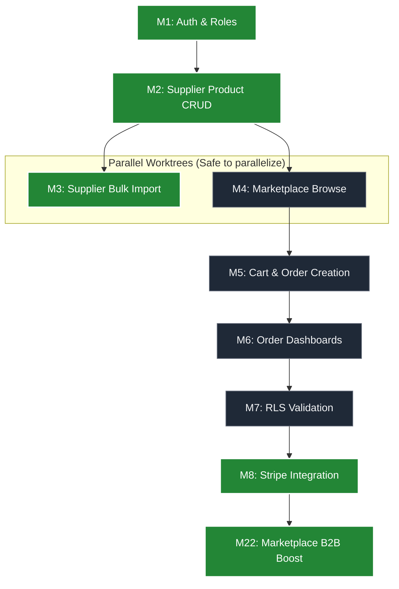

# Xpress Buke - Agentic Development Plan

This document tracks the progress of our Agentic Development Workflow (ADW) missions.

## Mission Lifecycle Commands
- **/adw-start [mission_number]**: Initiates a mission (pulls `dev` branch, initializes context, sets up task).
- **/adw-finish**: Finalizes a mission (runs typechecks, commits, pushes to `dev`, updates this tracker, and preps for deployment).

## Architecture & ADW Routing Flow

Use this Directed Acyclic Graph (DAG) to understand mission dependencies. 
**Rule of Thumb:** If two missions are on parallel branches of the graph (e.g., M3 and M4), you can use `git worktree` to spin up two parallel ADW agents to build them simultaneously without conflict.

---

## 🌊 WAVE 1: Core MVP (Production Blocking)

- [x] **Mission 1: Auth & Roles**
  - Next.js setup, Supabase link, Profiles schema & triggers, RLS, Auth Actions, basic routing.
- [x] **Mission 2: Supplier Product CRUD**
  - Supplier dashboard, Product tables, Supabase Storage for images, Server Actions.
- [x] **Mission 3: Supplier Bulk Import (Data Ingestion)**
  - CSV parsing, column mapping UI, data validation, and batch insertion for instant catalog onboarding.
- [x] **Mission 4: Marketplace Browse**
  - Public product list, detail pages, server-side data fetching for shops.
- [x] **Mission 5: Order Creation Flow**
  - Cart state, checkout action, pending orders, basic supplier dashboard order view.
- [x] **Mission 6: RLS Enforcement**
  - Define and apply strict Row Level Security for Profiles, Products, and Orders based on role.

## 🌊 WAVE 2: Payments & Hardening

- [x] **Mission 7: UI Polish & Optimization**
  - Human-led via Cursor + Agent. Glassmorphism, tailored palettes, loading states, premium aesthetics, Mobile UI flows.
- [x] **Mission 8: Guest Checkout Backend & E2E Testing (Stripe)**
  - Implement Guest Checkout backend flow and Stripe Checkout sessions.
  - Set up Playwright for comprehensive End-to-End (E2E) UI testing.

## 🌊 WAVE 3: Growth Overlay — Phase 1 (Status Layer)

- [ ] **Mission 9: Tiers & Badges Schema**
  - Create Tier tables, RLS, and Badge definitions.
- [ ] **Mission 10: Tier Engine**
  - Implement daily Tier Calculation cron job/function.
- [ ] **Mission 11: Status Dashboards**
  - Build Tier & Badge UI dashboards for Suppliers and Shops.

## 🌊 WAVE 4: Growth Overlay — Phase 2 (Viral Layer)

- [ ] **Mission 12: Network Graph**
  - Implement specific follows (Shop -> Supplier).
- [ ] **Mission 13: Invite Engine**
  - Build Referral logic (Codes, 3-stage completion, anti-gaming checks).
- [ ] **Mission 14: Showcases**
  - Arrangement photos, product tagging, likes.

## 🌊 WAVE 5: Growth Overlay — Phase 3 (Scarcity Engine)

- [ ] **Mission 15: Drops Schema**
  - Drops, Drop Items, and Drop Claims DB + RLS.
- [ ] **Mission 16: Drop Lifecycle**
  - Drop Lifecycle Functions (Cron jobs for scheduled->live, expiry).
- [ ] **Mission 17: Drop Administration**
  - Supplier Drop Management UI & Shop Drops Browse UI.
- [ ] **Mission 18: Drop Cart Engine**
  - Cart injection (Reserving drop items, TTL countdowns).

## 🌊 WAVE 6: Growth Overlay — Phase 4 (Trending)

- [ ] **Mission 19: Trending Schema**
  - Trending Snapshot + Entries tables & RLS.
- [ ] **Mission 20: Trending Engine**
  - Weekly cron job for trending calculation (products, suppliers, showcases).
- [ ] **Mission 21: Trending Interface**
  - Trending UI page.

## 🌊 WAVE 7: Core Extensibility & Scale

- [x] **Mission 22: Marketplace B2B Boost**
  - Implement Box Types (QB, HB, FB), Delivery Logistics (Pre-books/Standing), Quality Claims, and B2B Terms.
- [x] **Mission 23: Mobile Responsiveness Overhaul**
  - Overhaul landing, login, and signup pages with responsive Tailwind padding, auto heights, and typography to fit mobile screens perfectly.
