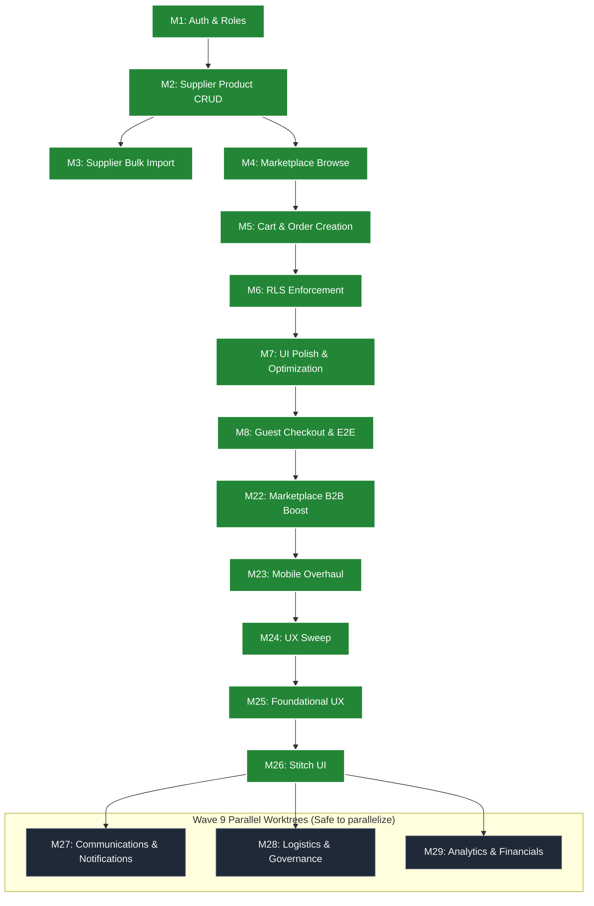

# Xpress Buke - Agentic Development Plan

This document tracks the progress of our Agentic Development Workflow (ADW) missions.

## Mission Lifecycle Commands
- **/adw-start [mission_number]**: Initiates a mission (pulls `dev` branch, initializes context, sets up task).
- **/adw-finish**: Finalizes a mission (runs typechecks, commits, pushes to `dev`, updates this tracker, and preps for deployment).
- **/feature**: Plans a new feature in detail (UI mockups, schema, backend logic) and generates an implementation plan for approval before execution.

## Architecture & ADW Routing Flow

Use this Directed Acyclic Graph (DAG) to understand mission dependencies. 
**Rule of Thumb:** If two missions are on parallel branches of the graph (e.g., M3 and M4), you can use `git worktree` to spin up two parallel ADW agents to build them simultaneously without conflict.

---

## 🌊 WAVE 1: Core MVP (Production Blocking)

- [x] **Mission 1: Auth & Roles**
  - Next.js 15 setup, Supabase Auth (email/password), Profiles schema & triggers, immutable role selection (`supplier`|`shop`), middleware route protection, basic routing.
- [x] **Mission 2: Supplier Product CRUD**
  - Supplier dashboard, `flower_products` table, Supabase Storage for images, `ProductForm` component with Zod validation, Server Actions for create/update/delete.
- [x] **Mission 3: Supplier Bulk Import (Data Ingestion)**
  - CSV parsing (Papaparse), column mapping UI (`ColumnMapper`, `CsvUploader`, `ImportFlow`, `ImportReview` components), data validation, and batch insertion via `bulkCreateProducts` action.
- [x] **Mission 4: Marketplace Browse**
  - Public product grid (`/shop/browse`), product detail pages (`/shop/browse/[id]`), `MarketplaceProductCard` component, server-side data fetching.
- [x] **Mission 5: Order Creation Flow**
  - Server-backed cart (`cart_items` table + `/shop/cart`), `AddToCartForm` & `CartItemControls` components, checkout action with atomic stock decrement, `order_groups` → `orders` → `order_items` creation, cart clearing.
- [x] **Mission 6: RLS Enforcement**
  - Strict Row Level Security on Profiles, Products, Cart, and Orders. Default deny, explicit allow. `20260305000001_rls_enforcement.sql` migration.

## 🌊 WAVE 2: Payments & Hardening

- [x] **Mission 7: UI Polish & Optimization**
  - Human-led via Cursor + Agent. Glassmorphism, tailored palettes, loading states, premium aesthetics, Mobile UI flows.
- [x] **Mission 8: Guest Checkout Backend & E2E Testing (Stripe)**
  - Stripe Checkout sessions (`src/lib/stripe.ts`), checkout gateway with auth-aware redirect (`/checkout/gateway`), payment page (`/checkout/payment`), order success page (`/checkout/success`).
  - Playwright E2E testing setup (`e2e/`, `playwright.config.ts`).

## 🌊 WAVE 7: Core Extensibility & Scale

- [x] **Mission 22: Marketplace B2B Boost**
  - Box Types (QB, HB, FB), Delivery Logistics (Pre-books, Standing Orders), Quality Claims system (tied to order items with evidence URLs), B2B Terms (credit limits, Net-30).
  - `20260307000001_marketplace_boost_schema.sql` migration. `claims.ts` server actions. Claims UI for both `/shop/claims/new` and `/supplier/claims`.
- [x] **Mission 23: Mobile Responsiveness Overhaul**
  - Responsive Tailwind padding, auto heights, and typography for landing, login, and signup pages. Dynamic signup role param from URL.
- [x] **Mission 24: UX Experience Review & Tandem Testing**
  - Subagent visual UX sweep across landing, shop, and supplier views. Permanent local DB `seed.sql`. Browser subagent integrated into `/adw-finish`. Documentation sync.
- [x] **Mission 25: Foundational UX Restructure**
  - Intelligent checkout gateway (auto-redirect authenticated users). Global nav shells: `ShopHeader` with cart badge and user dropdown for shop, `SupplierNav` sidebar for supplier. Local floral seed photos in `public/seeds/`.

## 🌊 WAVE 8: Premium L3 UX Overhaul

- [x] **Mission 25: Foundational UX Restructure**
  - Fix Checkout Auth Loop (make gateway intelligent & auto-redirect authenticated users).
  - Implement Global Navigation Shells (Sticky Sidebars/TopNavs) for Shop and Supplier dashboards.
  - Replace dummy image APIs with real, high-quality local floral seed photos to restore aesthetic immersion.
- [x] **Mission 26: Stitch UI Alignment & Aesthetic Overhaul**
  - Extracted design rules from Stitch "Xpress Buke UI Flows" project. Reconstructed Cart and Product Detail layouts to match premium L3 B2B standards. Supplier views aligned.

## 🌊 WAVE 9: B2B Trust Foundation (Parallel Execution — Completed Overnight)

- [x] **Mission 27: Communications & Notifications** (Parallel Stream A)
  - On-platform messaging schema/UI and webhooks/triggers for order & claim statuses.
- [x] **Mission 28: Logistics & Platform Governance** (Parallel Stream B)
  - Expanded order statuses (`processing`, `shipped`, `partially_fulfilled`) for perishables visibility.
  - Admin Dispute Resolution Dashboard.
- [x] **Mission 29: Analytics & Financial Reconciliation** (Parallel Stream C)
  - Supplier ROI Dashboard (`/supplier/analytics`) — KPI cards, revenue trend chart, top products table, order type breakdown.
  - Shop Billing & Reconciliation (`/shop/billing`) — Balance cards, credit utilization, transaction history table.
  - Net-30 Invoice Generation (`/api/invoice/[orderId]`) — Styled HTML invoice download per order.
  - Navigation updates: Analytics in SupplierNav, Billing in ShopHeader.

## 🌊 WAVE 10: Growth & Viral Overlays (Future)

*(Frozen until core MVP is validated by real users — see ADR-013)*

- [ ] **Missions 30+: Growth Pipeline**
  - **Drops & Scarcity**: High-ROI scarcity events for fresh floral inventory.
  - **Status & Badges**: Supplier/Shop tier calculations and badging.
  - **Referrals & Trending**: Network invites, Showcases, and trending calculations.

---

## Current Codebase Snapshot (as of 2026-03-08)

| Metric | Count |
|--------|-------|
| Completed missions | 17 (M1–M8, M22–M29) |
| Pending missions | Growth (M30+) |
| Migrations | 16+ SQL files |
| Server Action files | 8+ (`auth`, `cart`, `claims`, `communications`, `orders`, `products`, `profiles`, `analytics`) |
| Route pages | 22+ (dashboard + checkout + admin + analytics + billing) |
| ADRs | 16 architectural decisions |

